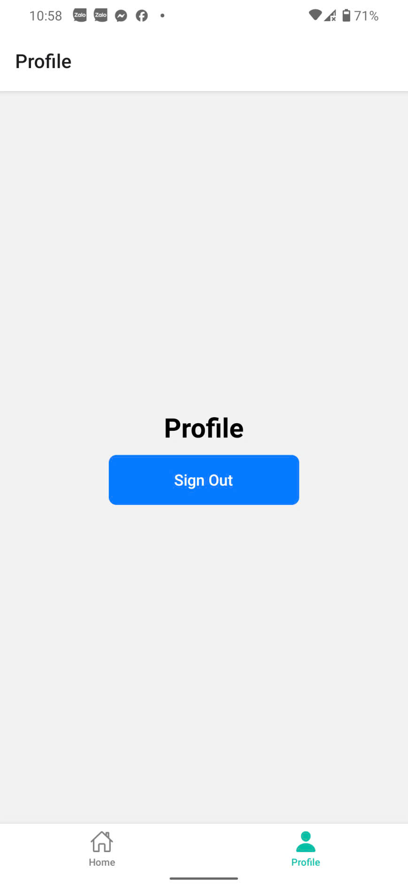

# Bài 8.1: Sử dụng Tab Navigation + Context API - React Native

## Thông tin sinh viên
- Họ và tên: Nguyễn Thanh Tịnh 
- Mã sinh viên: 23810310439

## Mô tả
- Tiếp tục từ bài 7.1
- Sử dụng Tab navigation tạo thanh điều hướng ở dưới màn hình
- Sử dụng Context API tạo biến toàn cục để mọi screen đều truy cập được

## Hình ảnh kết quả chạy
### Hình ảnh LoginScreen

### Hình ảnh HomeScreen

### Hình ảnh ProfileScreen
